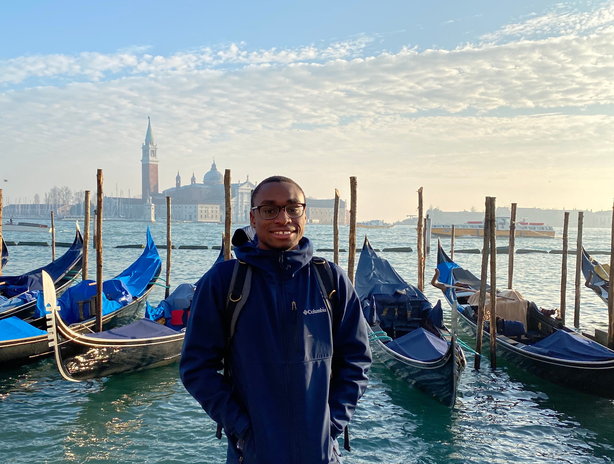

# About the blog 

I was truly inspired by the about page on [Devon's blog](https://devonzuegel.com). She's striving for relative frequent, short, incredibly informal updates and I think I'll do the same. I'll also probably talk about things besides just tech (like food, lots of food), but I'll be sure the segregate topics with tags.

# Who am I?

On a philosophical level, I've got no idea, but I'm figuring it out. On a practical level, I am (in no particular order):
- a geek
- who codes
- and absolutely loves food
- who happens to be African American
- and is from the American South
- also I'm currently based in Seattle

## As an engineer

I'm a software engineer at Microsoft who has been working full-time in software for about 3 years, doing mostly Nodejs development on DevOps teams.

On my current team, we've recently replaced a 25-year old third-party, contract management system with a modern, flexible first-party system. This system is critical to Microsoft's Premier support business and has an ecosystem that spans teams in multiple departments at Microsoft. One of my key focus areas on the team has been improving our reliability, maintainability, and run cost.

Before joining Microsoft, I worked at IBM for a year on an IBM CIO team formerly named Whitewater. They were the organization that brought a lot of new third-party tools (e.g. Slack, Github, PagerDuty, TravisCI, etc) into the company. As a team that managed and supported DevOps tools, we truly believed and practiced things like infrastructure as code, TDD, quality code reviews, pair programming, blameless postmortems, and good incident management. My squad managed a lot of "glue" code between IBM's systems and the various tools Whitewater supported. I learned a lot from that great group about engineering best practices and what the "digital transformation" buzzword actually looks like. 

And before that, I was a student at the University of Alabama where I did a B.S. in Computer Science while working part-time building all kinds of .NET systems for state and local government agencies primarily but not exclusively in the southeast.

### A non-exhaustive list of the tech I use

#### Daily
- NodeJS (both Express servers and the built-in APIs)
- React
- Angular
- GatsbyJS (for this site!)
- Docker
- Azure CosmosDB
- Various SQL implementations
- ECMAScript (I mention this specifically as I follow the specification pretty closely)

#### Things I use (or have used) at work, but don't have to touch daily anymore
- Redis (both as a cache and as an incredibly flexible primary data store)
- C#
- Java 
- Python (most 3+, but who hasn't had to drop in to maintain a Python 2 project?)
- MongoDB
- Kubernetes

#### Languages I'm learning/refreshing on while doing other things
- Golang
- C/C++

## Interesting things about me (I promise I'm not a robot):
- I've had dinner with Sir Tim Berners-Lee while visiting my friend who works at Inrupt. He's a super interesting guy and I really enjoyed meeting him.
- I've got to be a part of an official delegation from Tuscaloosa (where I grew up) over to Sunyani-Techiman back when I was in high school.
- My occasional insomnia sometimes results in my coworkers receiving baked goods the next morning. 
- Some day, I'd like to publish a novel.

My latest resume can generally be found [**here**](../files/resume.pdf).
